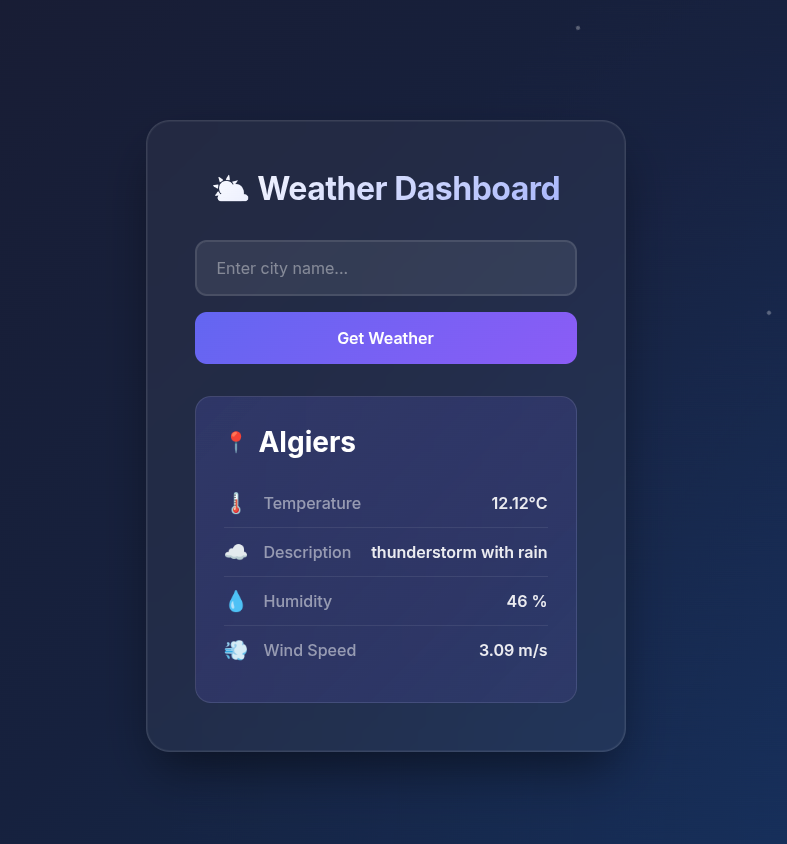

# ⛅ Weather Dashboard

A modern, elegant weather dashboard built with Flask that displays real-time weather information for any city worldwide.



---

## Features

- 🌡️ Real-time temperature data
- ☁️ Weather descriptions
- 💧 Humidity levels
- 💨 Wind speed information
- 📱 Fully responsive layout
- ✨ Smooth animations and particle effects

---

### Installation

1. **Clone the repository**
   ```bash
   git clone https://github.com/djedd1ne/Weather_Dashboard.git
   ```
   ```bash
   cd Weather_Dashboard
   ```
2. **Create virtual environment**
   ```bash
   python -m venv venv
   ```
3. **Activate the virtual environment**
   
   - Windows:
     ```bash
     venv\Scripts\activate
     ```
   - Mac/Linux:
     ```bash
     source venv/bin/activate
     ```

4. **Install dependencies**
   ```bash
   pip install -r requirements.txt
   ```

5. **Set up environment variables**
   Create your api key on https://openweathermap.org/
   Create a `.env` file in the `weather_app` directory:
   ```env
   API_KEY=your_openweathermap_api_key_here
   ```
6. **Run the application**
   ```bash
   cd weather_app
   python app.py
   ```

7. **Open your browser**
   
   Navigate to `http://localhost:5000`

---
